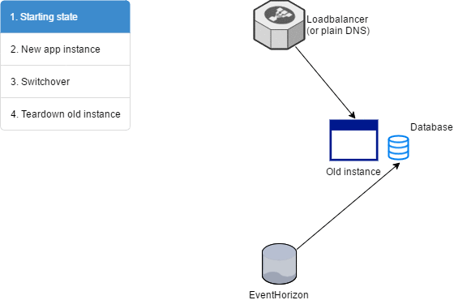

Tutorial for live migration
---------------------------



This tutorial walks you through from zero to 100 % on how to live migrate a
running service from a server to another with zero downtime, all the while the
service is accepting meaningful work.

At the end of the tutorial we prove that the service did not experience any
downtime from the client's perspective.

This tutorial does not require Digitalocean, Cloudflare or Docker, but is written
for that specific combination to form a concrete picture rather than you having to
fill in too many blanks with your imagination.

It is important to notice that both of the app instances are using their own
(non-clustered) database, so this really demonstrates live migrating state
to another system (which is a big deal), instead of just launching a new
application instance that uses state from a shared database with the old instance
(which would not be a big deal). In fact, this design would allows you to live
migrate state to a completely different backend/database stack. Think of
migrating from MySQL-backed state store to Redis backed state store with zero
downtime. Kinda cool, right?


Bring up the servers
--------------------

Create two servers ("droplets") in Digitalocean:

- Server A
- Server B


Create DNS record in Cloudflare
-------------------------------

Create record `ha.xs.fi` that points to `Server A`'s IP address.

Be sure to use the proxy feature of Cloudflare so TTL of DNS does not affect us
while migrating.


Start Writer
------------

It's up to you on which server you'll run the Writer service (I used `Server A`),
or you can even run it on a third server.

Follow https://github.com/function61/pyramid/blob/master/docs/quickstart.md

tl;dr follows:

Bootstrap Writer:

```
$ export STORE=...
$ docker run --rm -it -e "STORE=$STORE" fn61/pyramid sh
$ pyramid writer-bootstrap PUBLIC_IP_OF_WRITER_SERVER

# Ctrl + d
```

Then start:

```
$ docker run --name pyramid -d --net=host -e "STORE=$STORE" fn61/pyramid
```

Then bootstrap data structures

```
$ docker run --rm -it -e "STORE=$STORE" fn61/pyramid sh
$ pyramid stream-create /
$ pyramid stream-create /_sub
```


Bootstrap app datamodel
------------------------


First, bootstrap data structures and load in the example data:

```
$ docker run --rm -it -e "STORE=$STORE" fn61/pyramid-exampleapp-go bash
$ pyramid stream-create /example
$ pyramid stream-create /_sub/example-app
$ pyramid stream-subscribe /example /_sub/example-app
$ pyramid stream-appendfromfile /example example-dataimport/import.txt

# Ctrl + d
```

Now the base data is loaded to the `/example` stream that backs your app.


Start app in Server A
---------------------

Now, start the application:

```
$ docker run --name app_a -d -e "STORE=$STORE" -p 80:8080 fn61/pyramid-exampleapp-go

# check that logs look ok
$ docker logs app_a
...
```

Now, check that your service is responding and that the base data was loaded:

```
$ curl http://localhost/users
...
    {
        "ID": "e1dd2e26",
        "Name": "Kelly Kapoor",
        "Company": "629cfead"
    }
]
```

Start feeder
------------

Feeder is a program that bombards your service by continuously placing in orders
via the app's RESTful endpoint.

Orders in the app look like this:

```
{	
   "ID": "ffe0a300ac437dfd",
    "User": "a00ba373",
    "Ts": "2017-03-29 12:48:21",
    "LineItems": [
        {
            "Product": "Butt paper",
            "Amount": 6
        },
        {
            "Product": "Regular paper",
            "Amount": 5
        },
        {
            "Product": "Premium copy paper",
            "Amount": 8
        }
    ]
}
```

```
./feeder
2017/03/29 13:13:55 Usage: ./feeder <baseUrl> <ordersPerSec>
```

ordersPerSec is the target amount of orders to place per second. I seemed to get
exactly 40 so the throughput was either capped by Cloudflare or Feeder's parallelism
which is currently capped at 20 workers.

Now you'll be getting output like this:

```
$ ./feeder https://ha.xs.fi 100
2017/03/29 12:47:31 producer: failed = 0 succeeded = 0
2017/03/29 12:47:32 producer: failed = 0 succeeded = 4
2017/03/29 12:47:33 producer: failed = 0 succeeded = 40
2017/03/29 12:47:34 producer: failed = 0 succeeded = 40
2017/03/29 12:47:35 producer: failed = 0 succeeded = 40
```

The stress testing is now active. Now we can start migrating the service to
`Server B`.


Start app in Server B
---------------------

```
$ docker run --name app_b -d -e "STORE=$STORE" -p 80:8080 fn61/pyramid-exampleapp-go
```

Check that the order counts in server A and B match roughtly - that's how we know
we reached realtime:

```
# on Server A
$ curl -s http://localhost/orders | grep ID | wc -l
1640

# on Server B
$ curl -s http://localhost/orders | grep ID | wc -l
1678
```

=> match roughly: B's state is now realtime.

That means we can now direct users to the new server by changing the IP.


Update IP address to point to Server B
--------------------------------------

This is the critical moment, where your users will start using the new server.

Change the IP now.

Due to how Cloudflare works, this change is almost instant and not affected by DNS TTL.

Look at your feeder logs, and feeder soon notices that the server changed:

```
2017/03/29 12:49:02 responseprocessor: instance change detected: 93920041d320
2017/03/29 12:49:02 responseprocessor: instance change detected: 74faf0adcbaf
2017/03/29 12:49:02 responseprocessor: instance change detected: 93920041d320
2017/03/29 12:49:02 responseprocessor: instance change detected: 74faf0adcbaf
```

It is important to note that "instance change detected" is not an error - requests
are still being served normally. Our app sends a custom debugging HTTP header
with the server's ID only for the reason that our stress testing tool knows when
the switchover happens.

That might continue a while (I witnessed a scenario where both servers were
active at the same time). Wait until those notifications stop, and it continues with:

```
2017/03/29 12:49:03 producer: failed = 0 succeeded = 40
2017/03/29 12:49:04 producer: failed = 0 succeeded = 40
2017/03/29 12:49:05 producer: failed = 0 succeeded = 40
```

That means that the load has been completely shifted to the new server.

You can now stop the application on `Server A`:

```
$ docker rm -f app_a
```

And verify that feeder does not report any errors (it shouldnt, because the old
server is not used anymore)

You can now stop feeder (`Ctrl + c`) and we'll get the aggregate statistics:

```
2017/03/29 12:49:21 producer: failed = 0 succeeded = 40
2017/03/29 12:49:22 producer: failed = 0 succeeded = 40
^C
2017/03/29 12:49:23 stopping
2017/03/29 12:49:23 result: failed = 0 succeeded = 4344
```

None of the order submit requests failed.

Remember, this number (4344) is the client's (usually browsers') perspective,
of how many orders were submitted. If we now take a look at the database, and if
the database has as many orders stored as the tool reported, we know that
nothing got lost.

Now on `Server B`, recount how many orders are stored:

```
$ curl -s http://localhost/orders | grep ID | wc -l
4344
```

Awesome. We just live-migrated a service from `Server A` to `Server B` while it
was processing 40 orders a second!
